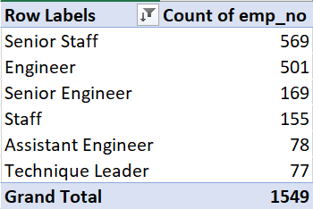
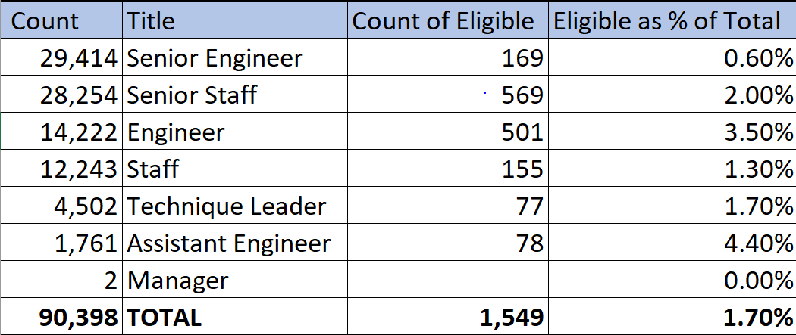

# Database with SQL

## PURPOSE OF THE ANALYSIS:

The purpose of the analysis is to help Bobby’s manager prepare for the “silver tsunami” by providing him by the number of retiring employees per title and identifying employees who are eligible to participate in a mentorship program. 

## Results:

- The larger portion of employees, a little more than 2/3, are in senior positions, with 33% as senior engineers and 31% as senior staff.
- Managerial positions account for less than 1% of the total employees (currently 2 managers only for a total of 90,398 employees)
- Only 1.7% of the employees are eligible for mentorship programs.
- While senior employees account for a little more than 2/3 of the total employees, the number of individuals eligible to mentorship program amongst this population account only for almost half of
- Eligible individuals, and none of the eligible employees is in a managerial position.

## ## Results:

- There is a total of 1,549 employees that will need to be replaced as the “silver Tsunami” will start to make an impact. 
- The additional table below is showing how this number is distributed among the different job titles/function, which provides very useful insight in preparing for the silver tsunami”:

The SQL Query used for this table is:

		select count(title) count_title, title
		from mentorship_eligibilty
		group by title
		order by count_title desc;

- The number of qualified, retirement-ready employees in each departments seems very low compared to the total number of employees belonging to the same department. This number in best cases does not exceed 4.4% and is getting much lower as we are looking into senior positions (0.6% among senior engineers and 2.0% among senior staff).
- This suggest that there might not be enough senior members to mentor the next generation of Pewlett Hackard employees.
- The table below is showing the % of eligible employees to mentorship program in each department/ for each job title and will be very useful for the management to prepare for the “silver Tsunami”, by shading the light on job titles where there is a the biggest gap.

The SQL Query used for this table is:
		select count(mentorship_eligibilty.title) count_eligible, retiring_titles.title,
		retiring_titles.count
		from mentorship_eligibilty
		RIGHT JOIN 	retiring_titles 
		on (mentorship_eligibilty.title=retiring_titles.title)
		group by retiring_titles.title,retiring_titles.count
		order by retiring_titles.count desc;
